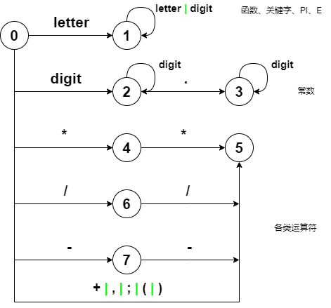
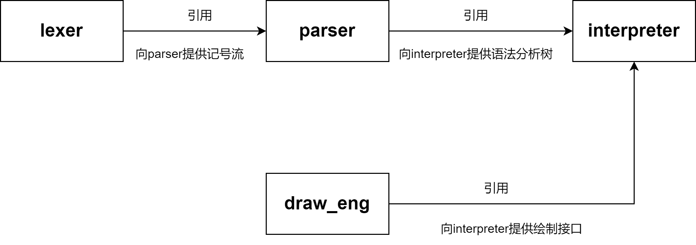
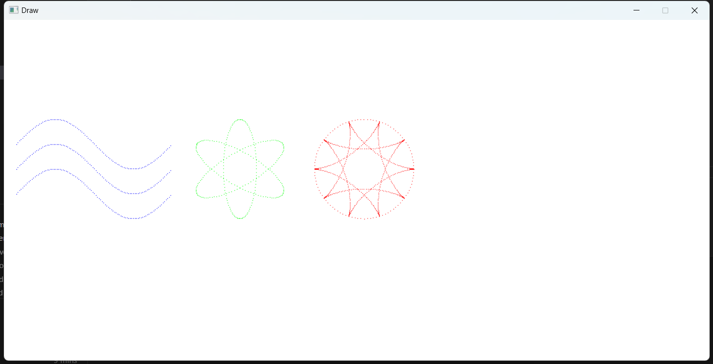

## 题目：函数绘图语言解释器

输入：用函数绘图语言编写的源程序，

1. 用词法分析器识别其中的记号（可将记号的信息显示出来）

2. 用语法分析器识别记号流中的语句（可将语句结构显示出来）

3. 解释器：词法分析、语法分析、语义分析/计算，绘制图形

**目的**：通过自己编写解释器，掌握语言分析基本方法

### 解释器的实现方法

1. 用C++和递归下降子程序方法编写完整的解释器

2. 利用工具 LEX/YACC 分别构造绘图语言的词法、语法分析器；用C++语言编写解释器的语义、主程序。


## 语句的语法和语义

1. 各类语句可以按任意次序书写，且非注释语句以分号结尾。解释器按照语句出现的先后顺序处理。

2. ORIGIN、ROT 和 SCALE 语句只影响其后的绘图语句，且遵循最后出现的语句有效的原则。例如，若有下述ROT语句序列：  

   ```
   ROT IS 0.7 ； …
   ROT IS 1.57 ； …
   ```

   则随后的绘图语句将按1.57而不是0.7弧度旋转。

3. 无论ORIGIN、ROT和SCALE语句的出现顺序如何，图形的变换顺序总是：比例变换→旋转变换→平移变换 

4. 语言对大小写不敏感，例如for、For、FOR等，均被认为是同一个保留字。

5. 语句中表达式的值均为双精度类型，旋转角度单位为弧度且为逆时针旋转，平移单位为像素点。 


### 循环绘图（FOR-DRAW ）语句 

语法：

 FOR T FROM 起点 TO 终点 STEP 步长 DRAW(横坐标, 纵坐标);


语义：

令T从起点到终点、每次改变一个步长，绘制出由(横坐标，纵坐标)所规定的点的轨迹。


举例：

FOR T FROM 0 TO 2*PI STEP PI/50 DRAW (cos(T), sin(T));


说明：

该语句的作用是令T从0到2*PI、步长 PI/50，绘制出各个点的坐标(cos(T)，sin(T))，即一个单位园。


注意：

由于绘图系统的默认值是

```
 ORIGIN IS (0,0);

 ROT IS 0;

 SCALE IS (1, 1);
```

所以实际绘制出的图形是在屏幕左上角的2个点。


### 比例设置(SCALE)语句

语法：

SCALE IS (横坐标比例因子，纵坐标比例因子);


语义：

设置横坐标和纵坐标的比例，并分别按照比例因子进行缩放。


举例：

```
SCALE IS (100, 100);
```


说明：

将横坐标和纵坐标的比例设置为1:1，且放大100倍。


### 坐标平移(ORIGIN)语句

语法：

ORIGIN IS (横坐标，纵坐标); 


语义：

将坐标系的原点平移到横坐标和纵坐标规定的点处。


举例：

ORIGIN IS (360, 240);


说明：

将原点从(0, 0)平移到(360, 240) 处。


### 角度旋转(ROT)语句

语法：

ROT IS 弧度值； 


语义：

绕原点逆时针旋转弧度值所规定的角度。计算公式：

 旋转后X=旋转前X*COS(弧度)+旋转前Y*SIN(弧度) 

 旋转后Y=旋转前Y*COS(弧度)-旋转前X*SIN(弧度)


举例：

```
ROT IS PI/2;
```


说明：

逆时针旋转PI/2，即逆时针旋转90度。


### 注释语句

注释的作用：

便于理解；屏蔽暂时不需要的语句。


语法：

// This is a comment line 

或  -- 此行是注释


语义：

// 或 -- 之后，直到行尾，均是注释


## 样例


```
ORIGIN IS (360, 240);	// (1) 原点移至(360, 240)
SCALE IS (100, 100);	// (2) 图形放大100
SCALE IS (100, 100/3);	// (3) 纵坐标缩小为三分之一
ROT IS PI/2;		// (4) 逆时针旋转90度

-- 绘制园的轨迹
FOR T FROM 0 TO 2*PI STEP PI/50 DRAW (cos(T), sin(T));

```


```
--糖葫芦
origin is (350, 260);					-- 原点位置
rot is 0;						-- 旋转角度为零
scale is (2, 1);
for T from -150 to 250 step 1 draw (0, -t);	
scale is (50, 50);					
for t from 0 to 2*pi step pi/100 draw(cos(t), sin(t));	
origin is (350, 160);					-- 原点位置
scale is (50, 50);					
for t from 0 to 2*pi step pi/100 draw(cos(t), sin(t));	
origin is (350, 60);					-- 原点位置
scale is (50, 50);					
for t from 0 to 2*pi step pi/100 draw(cos(t), sin(t));	

--太阳花
origin is (550, 260);					-- 原点位置
rot is 0;						-- 旋转角度为零
scale is (2, 1);
for T from -150 to -5 step 1 draw (0, -t);	
origin is (550, 240);	
scale is (30, 30);					
for t from 0 to 2*pi step pi/100 draw(cos(t), sin(t));	
origin is (550, 160);					-- 原点位置
scale is (50, 50);					
for t from 0 to 2*pi step pi/100 draw(cos(t), sin(t));	
origin is (550, 80);					-- 原点位置
scale is (30, 30);					
for t from 0 to 2*pi step pi/100 draw(cos(t), sin(t));	
origin is (630, 160);					-- 原点位置
scale is (30, 30);					
for t from 0 to 2*pi step pi/100 draw(cos(t), sin(t));	
origin is (470, 160);					-- 原点位置
scale is (30, 30);					
for t from 0 to 2*pi step pi/100 draw(cos(t), sin(t));	
origin is (490, 103);					-- 原点位置
scale is (30, 30);					
for t from 0 to 2*pi step pi/100 draw(cos(t), sin(t));	
origin is (610, 103);					-- 原点位置
scale is (30, 30);					
for t from 0 to 2*pi step pi/100 draw(cos(t), sin(t));	
origin is (490, 217);					-- 原点位置
scale is (30, 30);					
for t from 0 to 2*pi step pi/100 draw(cos(t), sin(t));	
origin is (610, 217);					-- 原点位置
scale is (30, 30);					
for t from 0 to 2*pi step pi/100 draw(cos(t), sin(t));	
 --叶子
origin is (515, 350);
rot is 120;						
scale is (20, 50);					
for t from 0 to 2*pi step pi/100 draw(cos(t), sin(t));	
origin is (585, 350);
rot is 480;						
scale is (20, 50);					
for t from 0 to 2*pi step pi/100 draw(cos(t), sin(t));	

```


## 词法


```
letter= [a—zA-Z]
digit = [0-9]

COMMENT ="//"|"--"
WHITE_SPACE = (" "|"\t"|"\n")+
SEMICO = ";"
L_BRACKET = "("
R_BRACKET = ")"
COMMA = ","
PLUS = "+"
MINUS = "-"
MUL = "*"
DIV = "/"
POWER = "**"
CONST_ID = digit+("." digit*)?
ID = letter+(letter|digit)*
```


**DFA**




## 语法

```
Program -> 
	{Statement SEMICO}
Statement -> 
	OriginStatment | ScaleStatment | RotStatment | ForStatment 
OriginStatment ->
	ORIGIN IS L_BRACKET Expression COMMA Expression R_BRACKET
ScaleStatment ->
	SCALE IS L_BRACKET Expression COMMA Expression R_BRACKET
RotStatment -> 
	ROT IS Expression
ForStatment ->
	FOR T FROM Expression TO Expression STEP Expression DRAW L_BRACKET Expression COMMA Expression R_BRACKET 
Expression ->
	Term {(PLUS|MINUS) Term}
Term ->
	Factor {(MUL|DIV) Factor}
Factor->
	PLUS Factor| MINUS Factor | Component
Component->
	Atom POWER Component | Atom
Atom->
	CONST_ID
	| T
	| FUNC L_BRACKET Expression R_BRACKET
    | L_BRACKET Expression R_BRACKET
```


## 原创工作


**OOP**

使用OOP面向对象思想实现





**支持COLOR语句**

```c++
void Interpreter::interColor()
{
    parser.match(COLOR);
    parser.match(IS);
    parser.match(L_BRACKET);
    color_r=parser.parseExpression()->eval();
    parser.match(COMMA);
    color_g=parser.parseExpression()->eval();
    parser.match(COMMA);
    color_b=parser.parseExpression()->eval();
    parser.match(R_BRACKET);
    draw_eng.setColor(RGB(color_r, color_g, color_b));
}
```


展示




**符号表**

使用哈希表实现，查找效率更高

```c++
//符号表，使用哈希表实现
static std::unordered_map<std::string, Token> token_tbl = {
    {"PI",     {CONST_ID, "PI",    3.1415926, nullptr}},
    {"E",      {CONST_ID, "E",     2.71828,   nullptr}},
    {"T",      {T,        "T",     0.0,       nullptr}},
    {"SIN",    {FUNC,     "SIN",   0.0,       std::sin}},
    {"COS",    {FUNC,     "COS",   0.0,       std::cos}},
    {"TAN",    {FUNC,     "TAN",   0.0,       std::tan}},
    {"LN",     {FUNC,     "LN",    0.0,       std::log}},
    {"EXP",    {FUNC,     "EXP",   0.0,       std::exp}},
    {"SQRT",   {FUNC,     "SQRT",  0.0,       std::sqrt}},
    {"ORIGIN", {ORIGIN,   "ORIGIN",0.0,       nullptr}},
    {"SCALE",  {SCALE,    "SCALE", 0.0,       nullptr}},
    {"ROT",    {ROT,      "ROT",   0.0,       nullptr}},
    {"IS",     {IS,       "IS",    0.0,       nullptr}},
    {"FOR",    {FOR,      "FOR",   0.0,       nullptr}},
    {"FROM",   {FROM,     "FROM",  0.0,       nullptr}},
    {"TO",     {TO,       "TO",    0.0,       nullptr}},
    {"STEP",   {STEP,     "STEP",  0.0,       nullptr}},
    {"DRAW",   {DRAW,     "DRAW",  0.0,       nullptr}}
};
```


**宏**

```c++
//宏定义，便于维护枚举和字符串数组
#define FOREACH_TOKEN(TOKEN) \
        TOKEN(ORIGIN)   \
        TOKEN(SCALE)    \
        TOKEN(ROT)      \
        TOKEN(IS)       \
        TOKEN(TO)       \
        TOKEN(STEP)     \
        TOKEN(DRAW)     \
        TOKEN(FOR)      \
        TOKEN(FROM)     \
        TOKEN(T)        \
        TOKEN(SEMICO)   \
        TOKEN(L_BRACKET)\
        TOKEN(R_BRACKET)\
        TOKEN(COMMA)    \
        TOKEN(PLUS)     \
        TOKEN(MINUS)    \
        TOKEN(MUL)      \
        TOKEN(DIV)      \
        TOKEN(POWER)    \
        TOKEN(FUNC)     \
        TOKEN(CONST_ID) \
        TOKEN(NONTOKEN) \
        TOKEN(ERRTOKEN)
// 生成枚举
#define GENERATE_ENUM(ENUM) ENUM,
enum TokenType {
    FOREACH_TOKEN(GENERATE_ENUM)
};

// 生成枚举对应的string数组
#define GENERATE_STRING(STRING) #STRING,
static std::string token_name[] = {
    FOREACH_TOKEN(GENERATE_STRING)
};

```


利用string数组输出更友好的报错信息

```c++
void Parser::error(ErrorType error_type,TokenType expected)
{
    switch (error_type)
    {
    case ErrorType::INVALID_TOKEN:
        
        printf("line %" PRIu64 ": invalid token %s\n", lexer.getLineNo(), cur_token.name.c_str());
        break;
    case ErrorType::NOT_EXP_TOKEN:
        printf("line %" PRIu64 ": not expected token %s, expected %s\n", lexer.getLineNo(), cur_token.name.c_str(),token_name[expected].c_str());
        break;
    default:
        break;
    }
    exit(EXIT_FAILURE);
}
```


**语法树**

使用抽象类ASTNode构造语法树，BinOpNode、ConstNode、TNode、FuncNode均继承自ASTNode

TNode中使用param作为静态成员变量，使得每个TNode共享同样的参数值

```cpp
class ASTNode
{
public:
    virtual ~ASTNode() = default;
    // 纯虚函数，用于计算节点的值
    virtual double eval() const = 0;
};
//语法树节点指针
using NodePtr = std::unique_ptr<ASTNode>;
//二元运算符
class BinOpNode : public ASTNode
{
public:
    explicit BinOpNode(TokenType o, NodePtr l, NodePtr r)
        : left(std::move(l)), op(o), right(std::move(r)) {}
    double eval() const override
    {
        switch (op)
        {
        case PLUS:
            return left->eval() + right->eval();
        case MINUS:
            return left->eval() - right->eval();
        case MUL:
            return left->eval() * right->eval();
        case DIV:
            return left->eval() / right->eval();
        case POWER:
            return pow(left->eval(), right->eval());
        default:
            return 0.0;
        }
    }

private:
    TokenType op;
    NodePtr left;
    NodePtr right;
};

//常数
class ConstNode : public ASTNode
{
public:
    explicit ConstNode(double v) : val(v) {}
    double eval() const override
    {
        return val;
    }

private:
    double val;
};

//参数
class TNode : public ASTNode
{
public:
    //所有的TNode应当共享一个param
    static double param;
    double eval() const override
    {
        return param;
    }

};

//函数
class FuncNode : public ASTNode
{
public:
    FuncNode(MathFuncPtr f, NodePtr c) : func(f), child(std::move(c)) {}
    double eval() const override
    {
        return (*func)(child->eval());
    }

private:
    MathFuncPtr func;
    NodePtr child;
};
```


**内存管理**

使用智能指针进行节点内存管理

```c++
using NodePtr = std::unique_ptr<ASTNode>;
```


**绘图引擎**

使用DrawEngine创建Windows窗口并向interpreter提供绘制接口

```c++
class DrawEngine {
public:
    DrawEngine();

    ~DrawEngine();

    void drawPixel(int x, int y);
    void setColor(COLORREF c);
private:
    // 绘制的窗口的句柄
    HWND hwnd;
    // 窗口的设备上下文
    HDC hdc;
    // 默认为蓝色
    COLORREF color;
    void createWindow();
    // 处理窗口消息
    static LRESULT CALLBACK WindowProc(HWND hwnd, UINT uMsg, WPARAM wParam, LPARAM lParam);
};
```

